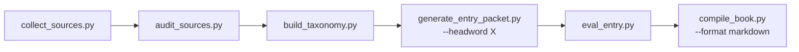

<div align="center">

# The Abstraction Dictionary · authoring pipeline

**Tooling that powers a long-form reference manuscript — source acquisition, auditing, taxonomy, entry packets, drafting/review automation, evaluation gates, compilation.**

<br/>


</div>

---

## What this repo is — and isn't

This repository is the **tooling** behind the manuscript. The manuscript itself, figure art, and research corpus are **not** stored here; they live locally and are gitignored.

If you're here to build: this is the pipeline. If you're here to read: the book is published separately.

---

## Layout

| Path | Purpose |
|------|---------|
| `book-project/scripts/` | Pipeline — collect · audit · taxonomy · packets · write/review/eval · compile drivers · prompt experiments |
| `book-project/prompts/` | Stage prompts for agents / CLI steps |
| `book-project/docs/` | Tool audits · role maps · repo keep/drop notes |
| `book-project/` + `*.md` | Pipeline contracts — `ENTRY_SCHEMA.md`, `SOURCE_POLICY.md`, `EVAL_POLICY.md`, `ROADMAP.md`, `AGENTS.md`, `program.md` |

### Local-only (gitignored)

- Entry text (`entries/`), front matter, appendices, cover/figure art, compiled exports
- `corpus/` — raw · normalized · snapshots · source cards
- Taxonomy outputs · eval run artifacts · `BOOK_BIBLE` / style / entry templates

Clone this repo, then restore or generate those directories locally for a full build.

---

## Pipeline



---

## Quick start

```bash
cd book-project
python -m venv .venv && source .venv/bin/activate
pip install -r requirements.txt

# Example steps (see --help per script)
python scripts/collect_sources.py --topic "prompt engineering"
python scripts/audit_sources.py
python scripts/build_taxonomy.py
python scripts/generate_entry_packet.py --headword "specificity"
python scripts/eval_entry.py --headword "specificity"
python scripts/compile_book.py --format markdown
```

Scraping integrations (e.g. Scrapling) and external tool repos are documented in `book-project/docs/`; dependency clones live under `book-project/external/` (ignored).

---

## License

Original **code and pipeline documentation** in this repository: use per your project policy. Manuscript and corpus you generate locally are separate. Third-party code under `external/` retains its own licenses.

---

<div align="center">
<sub>Part of <a href="https://github.com/pbathuri">@pbathuri</a>'s <a href="https://github.com/pbathuri/Map_Projects_MAC">project portfolio</a> — long-form writing infrastructure.</sub>
</div>
